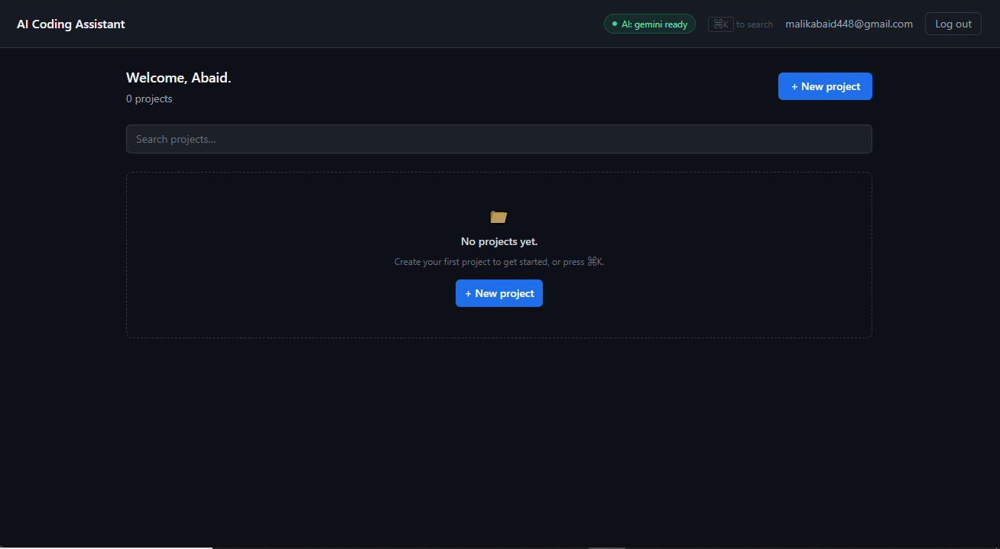
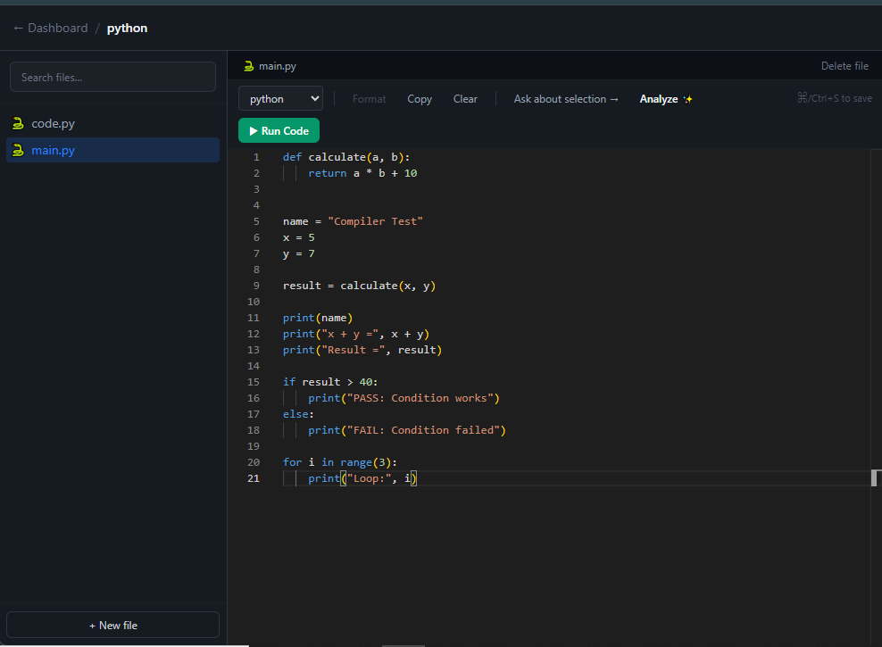
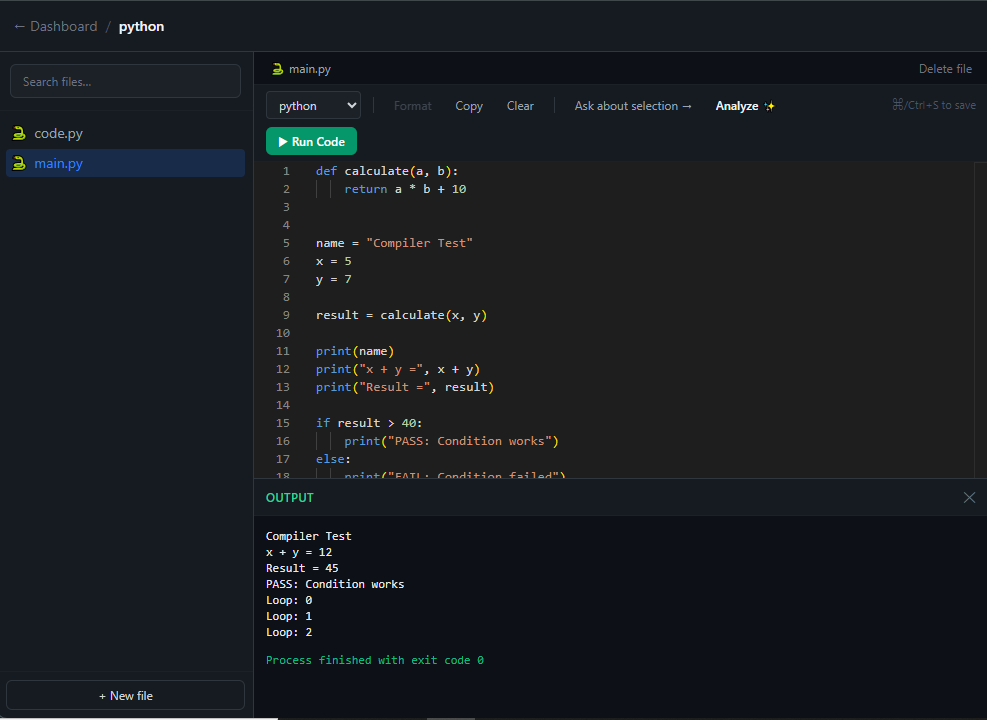

<div align="center">


<br>


<br>

<p>
  
  
  
  
</p>

<p>
  
  
  
  
  
  
</p>

<br>

**A full-stack AI coding workspace for managing projects, editing code, chatting with AI, reviewing code, generating tests and documentation, analyzing code quality, and applying AI-assisted changes through a real diff-review workflow.**

</div>

---

## ✦ What Is This?

**AI Coding Assistant** is a full-stack development workspace designed around one idea:

> **Keep the developer in control while AI assists with the code.**

The application combines:

* 🗂️ Project & file management
* 🧑‍💻 Monaco-based code editing
* 🤖 AI coding assistance
* 💬 Context-aware AI chat
* 🔍 Code review
* 🐛 Debugging assistance
* ⚡ Code optimization
* 🧪 Test generation
* 📝 Documentation generation
* 📊 Code-quality analysis
* 🔀 AI diff review & controlled application
* 🔐 Multi-user isolation
* 🛡️ CSRF protection
* 📁 File/path validation
* ⌘ Command palette
* 🔔 Toast notifications

The project has been implemented across **Phases 0–11**, with **135 automated tests currently passing**.

---

## ✨ Feature Highlights

<table>
<tr>
<td width="50%">

### 🧑‍💻 Development Workspace

* Project CRUD
* File CRUD
* Virtual folders
* Folder rename
* Project search
* Monaco Editor
* Language selection
* Save / Ctrl+S
* Copy / Clear
* Code formatting
* Dark editor theme
* Line numbers

</td>

<td width="50%">

### 🤖 AI Development

* AI Chat
* Context selection
* Explain Code
* Generate Code
* Debug Code
* Code Review
* Optimize Code
* Generate Tests
* Generate Documentation
* Regenerate responses
* Ask about selected code

</td>
</tr>

<tr>
<td>

### 🔐 Security

* Multi-user isolation
* Ownership enforcement
* CSRF protection
* Secure password hashing
* Rate limiting
* Signed authentication tokens
* Session tampering protection
* File extension validation
* Path traversal protection
* Generic authentication responses

</td>

<td>

### 📊 Intelligence & UX

* Code Analysis Dashboard
* Quality scores
* Complexity analysis
* Issue severity breakdown
* Review history
* Quality trend
* Diff review
* Accept / Reject changes
* Toast notifications
* Shared loading states
* Command palette

</td>
</tr>
</table>

---

# 🧭 Table of Contents

* [Architecture](#-architecture)
* [Implementation Progress](#-implementation-progress)
* [Phase Breakdown](#-phase-breakdown)
* [Multi-User Isolation](#-multi-user-isolation)
* [Code Editor](#-code-editor)
* [AI Architecture](#-ai-provider-architecture)
* [AI Chat](#-ai-chat)
* [Code Intelligence](#-code-intelligence)
* [Diff Review](#-diff-review--controlled-ai-changes)
* [Code Analysis Dashboard](#-code-analysis-dashboard)
* [Security Hardening](#-security-hardening)
* [Project Structure](#-project-structure)
* [Running Locally](#-running-locally)
* [Testing](#-testing)
* [Authentication Flow](#-authentication-flow)
* [Documentation](#-project-documentation)
* [Current Status](#-project-status)

---

# 🏗 Architecture

```text
                         ┌─────────────────────────┐
                         │        Browser          │
                         │                         │
                         │ React + Vite + Tailwind │
                         │       Monaco Editor     │
                         └────────────┬────────────┘
                                      │
                                      │ /api/*
                                      ▼
                         ┌─────────────────────────┐
                         │       Flask API         │
                         │                         │
                         │ Authentication          │
                         │ Projects / Files        │
                         │ Conversations           │
                         │ AI / Code Intelligence  │
                         └────────────┬────────────┘
                                      │
                  ┌───────────────────┼───────────────────┐
                  │                   │                   │
                  ▼                   ▼                   ▼
          ┌──────────────┐    ┌───────────────┐   ┌───────────────┐
          │   Services   │    │    Models     │   │    Utils      │
          │              │    │               │   │               │
          │ AI           │    │ Users         │   │ Ownership     │
          │ Chat         │    │ Projects      │   │ CSRF          │
          │ Code         │    │ Files         │   │ Validation    │
          │ Projects     │    │ Reviews       │   │               │
          └──────┬───────┘    └───────┬───────┘   └───────────────┘
                 │                     │
                 ▼                     ▼
        ┌─────────────────┐    ┌─────────────────┐
        │ AI Providers    │    │    SQLite DB    │
        │                 │    │                 │
        │ Gemini          │    │ Users           │
        │ Groq (stub)     │    │ Projects        │
        │ OpenRouter      │    │ Files           │
        │ Claude (stub)   │    │ Conversations   │
        └─────────────────┘    │ Reviews         │
                               │ Tests / Docs    │
                               └─────────────────┘
```

The backend follows a **service-oriented architecture** so API routes remain thin while business logic lives in reusable services.

---

# 🚀 Implementation Progress

```text
Phase 00  ████████████████████  Scaffolding
Phase 01  ████████████████████  Data Layer
Phase 02  ████████████████████  Authentication
Phase 03  ████████████████████  Multi-user Isolation
Phase 04  ████████████████████  Projects & Files
Phase 05  ████████████████████  Monaco Editor
Phase 06  ████████████████████  AI Architecture
Phase 07  ████████████████████  AI Chat
Phase 08  ████████████████████  Code Intelligence
Phase 09  ████████████████████  Diff + Analysis
Phase 10  ████████████████████  UI Polish
Phase 11  ████████████████████  Security Hardening
```

**11 phases completed • 135 tests passing**

---

# 🧩 Phase Breakdown

<details>
<summary><b>Phase 0 — Scaffolding</b></summary>

* Flask application
* React + Vite frontend
* Tailwind CSS
* Environment configuration
* Development / testing / production configuration
* Initial project structure

</details>

<details>
<summary><b>Phase 1 — Data Layer</b></summary>

Complete database model layer with:

* Users
* Projects
* Files
* Conversations
* Messages
* Code reviews
* Code analysis
* Generated tests
* Documentation

Foreign keys, indexes and cascading relationships are included.

</details>

<details>
<summary><b>Phase 2 — Authentication</b></summary>

Complete authentication flow:

* Registration
* Login
* Logout
* Email verification
* Resend verification
* Forgot password
* Password reset
* Change password
* Secure password hashing
* Rate limiting
* Session cookies

Authentication responses are designed to reduce account enumeration.

</details>

<details>
<summary><b>Phase 3 — Multi-User Isolation</b></summary>

A centralized ownership contract ensures users can only access their own resources.

The system deliberately returns **404** when a resource exists but belongs to another user.

This prevents exposing whether another user's resource ID exists.

</details>

<details>
<summary><b>Phase 4 — Projects & Files</b></summary>

* Project CRUD
* File CRUD
* Virtual folders
* Folder rename
* Project search
* Dashboard
* Project workspace
* Ownership checks

Folders are represented through `folder_path` rather than a dedicated Folder table.

</details>

<details>
<summary><b>Phase 5 — Monaco Editor</b></summary>

A real Monaco-based editor provides:

* Syntax-aware editing
* Language selector
* Dark theme
* Line numbers
* Copy
* Clear
* Format
* Save
* Ctrl/Cmd+S

The Monaco runtime currently loads through its default CDN-based loader.

</details>

<details>
<summary><b>Phase 6 — AI Provider Architecture</b></summary>

The AI layer is provider-agnostic.

```text
AIService
   │
   ├── GeminiProvider       ✓ Implemented
   ├── GroqProvider         ○ Stub
   ├── OpenRouterProvider   ○ Stub
   └── ClaudeProvider      ○ Stub
```

Routes and features communicate with `AIService`, not individual providers.

This means additional providers can be implemented without rewriting the AI features.

</details>

<details>
<summary><b>Phase 7 — AI Chat</b></summary>

AI chat includes:

* Persistent conversations
* Persistent messages
* Context selection
* Current-file context
* Selected-code context
* Auto-titling
* Regenerate
* Failure-safe message persistence

Context limits:

```text
Conversation history → max 10 messages
Current file         → max 6,000 characters
Selected code        → max 4,000 characters
```

A file from another project is rejected from the AI context.

</details>

<details>
<summary><b>Phase 8 — Code Intelligence</b></summary>

Seven AI-powered capabilities:

| Feature       | Persistence | Purpose                              |
| ------------- | ----------- | ------------------------------------ |
| Explain       | Ephemeral   | Understand code                      |
| Generate      | Ephemeral   | Generate code                        |
| Debug         | Ephemeral   | Suggest corrections                  |
| Review        | Persistent  | Analyze quality/security/performance |
| Optimize      | Ephemeral   | Improve implementation               |
| Tests         | Persistent  | Generate tests                       |
| Documentation | Persistent  | Generate documentation               |

AI responses are defensively parsed so malformed model output does not automatically become a server error.

</details>

<details>
<summary><b>Phase 9 — Diff Review & Analysis</b></summary>

AI-generated modifications no longer overwrite the editor immediately.

Instead:

```text
AI Suggestion
      │
      ▼
  Diff Editor
      │
 ┌────┴────┐
 ▼         ▼
Accept    Reject
 │         │
 ▼         ▼
Draft     Discard
Dirty     Change
```

The phase also introduced the Code Analysis Dashboard.

</details>

<details>
<summary><b>Phase 10 — UI Polish</b></summary>

* Toast notifications
* Shared loading states
* Shared empty states
* Global command palette
* Ctrl/Cmd+K
* Project search
* Project quick creation

The UI now uses consistent interaction feedback across the application.

</details>

<details>
<summary><b>Phase 11 — Security Hardening</b></summary>

Concrete security gaps identified during an audit were addressed:

* CSRF protection
* File extension validation
* Filename validation
* Folder-path validation
* Path traversal protection
* Null-byte rejection
* Mutating-route authentication audit
* Rate-limit audit
* Session tampering test

**28 new tests** were added during this phase.

</details>

---

# 🔐 Multi-User Isolation

One of the project's core architectural contracts is ownership enforcement.

Two rules govern every resource:

### 01 — Ownership comes from the session

The authenticated user's ID always comes from `current_user`.

Client-provided values such as:

```json
{
  "user_id": 999
}
```

cannot override ownership.

### 02 — Foreign resources behave like missing resources

If a resource exists but belongs to another user:

```text
404 Not Found
```

instead of:

```text
403 Forbidden
```

This avoids confirming that another user's resource exists.

Centralized helpers:

```python
get_owned_or_404(Model, id)
owned_query(Model)
```

are used instead of unrestricted queries.

---

# 📁 Folder Model

There is intentionally **no Folder database table**.

A folder is represented by the shared `folder_path` of its files.

Example:

```text
src/
├── main.py
└── utils/
    ├── auth.py
    └── helpers.py
```

Internally:

```text
main.py      → ""
auth.py      → "src/utils"
helpers.py   → "src/utils"
```

Folder rename performs a bulk path rewrite across all nested files.

Empty folders do not exist until a file is created inside them.

---

# 🧑‍💻 Monaco Code Editor

The editor is built around Monaco:

```text
@monaco-editor/react
```

Capabilities include:

* Language selection
* Syntax-aware editing
* Format
* Copy
* Clear
* Dark theme
* Line numbers
* Ctrl/Cmd+S
* Dirty-state tracking
* AI-assisted actions

### Save model

```text
Edit
 ↓
Draft
 ↓
Dirty
 ↓
Save / Ctrl+S
 ↓
Persisted file
```

Changing the language is metadata and is persisted immediately.

Code changes remain local until explicitly saved.

### Formatting

Formatting is enabled only where Monaco provides a built-in formatter:

* JavaScript
* TypeScript
* JSON
* HTML
* CSS

Other languages display an explanatory disabled state.

---

# 🤖 AI Provider Architecture

The entire provider layer lives under:

```text
server/services/ai/
```

```text
                 AIService
                    │
          ┌─────────┼─────────┐
          │         │         │
       Gemini     Groq    OpenRouter
          │       stub       stub
          │
       key rotation
          │
       ┌──┴──┐
       ▼     ▼
     Key 1  Key 2 ...
```

### Gemini Key Rotation

The Gemini provider rotates keys for:

* `429` rate limits
* `401`
* `403`
* `5xx`
* Network failures

It does **not** rotate on ordinary `400` errors because the same malformed request would fail regardless of which key is used.

Once a key succeeds, it becomes the preferred key for subsequent calls.

---

# 💬 AI Chat

AI chat supports controlled context rather than blindly sending an entire project.

### Context

```text
Conversation
 └── Last 10 messages

Current File
 └── Max 6,000 characters

Selected Code
 └── Max 4,000 characters
```

Selected code takes precedence when both current-file and selection context are available.

### Failure-safe persistence

The user's message is stored **before** the AI request.

Therefore:

```text
User message
     ↓
Persist
     ↓
AI request
     │
     ├── Success → assistant response
     │
     └── Failure → message remains saved
```

A provider outage does not silently erase what the user typed.

---

# 🧠 Code Intelligence

All seven capabilities share the same source-resolution and AI infrastructure.

| Capability       | Description                              |
| ---------------- | ---------------------------------------- |
| 🔎 Explain       | Understand existing code                 |
| ✨ Generate       | Generate code from a description         |
| 🐛 Debug         | Suggest corrections                      |
| 🛡️ Review       | Find quality/security/performance issues |
| ⚡ Optimize       | Produce an improved implementation       |
| 🧪 Tests         | Generate framework-aware tests           |
| 📝 Documentation | Generate documentation                   |

Supported generated-test frameworks include:

```text
pytest
unittest
jest
mocha
junit
```

AI output is parsed defensively.

The application does not assume the model will perfectly follow JSON or code-fence instructions.

---

# 🔀 Diff Review — Controlled AI Changes

AI suggestions are never silently written into the saved file.

Instead:

```text
Current Draft
     │
     │
     ▼
 AI Suggestion
     │
     ▼
┌─────────────────────┐
│   Monaco DiffEditor │
│                     │
│ Original │ Proposed │
└──────────┬──────────┘
           │
      ┌────┴────┐
      ▼         ▼
   Accept     Reject
      │         │
      ▼         ▼
 Dirty Draft  No Change
```

**Accept** applies the change to the editor draft.

**Reject** discards it.

The user still has to explicitly **Save** the modified file.

---

# 📊 Code Analysis Dashboard

The dashboard provides AI-assisted project-level analysis.

It includes:

* Quality score
* Security score
* Performance score
* Maintainability score
* Complexity summary
* Issue count
* Severity breakdown
* Review history
* Quality trend

Severity levels:

```text
Critical
High
Medium
Low
Suggestion
```

Scores are explicitly presented as **AI-assisted estimates**, not certifications.

The dashboard also includes a lightweight CSS sparkline showing the quality trend across the latest reviews.

---

# 🛡️ Security Hardening

Phase 11 focused on concrete audit findings.

## CSRF Protection

The API uses a double-submit cookie approach.

```text
Login
  │
  ▼
csrf_token cookie
  │
  ▼
Frontend reads cookie
  │
  ▼
X-CSRF-Token header
  │
  ▼
Authenticated mutation
```

The server compares the cookie and header using:

```python
hmac.compare_digest()
```

State-changing authenticated API requests require the token.

---

## File Validation

File creation and rename operations validate:

* Allowed extensions
* Extensionless allowlisted filenames
* `..` traversal segments
* Null bytes
* Path separators
* Folder paths

Examples such as:

```text
../evil.py
```

are rejected.

Common extensionless files such as:

```text
Dockerfile
Makefile
README
```

remain supported through an explicit allowlist.

---

## Authentication Security

The application also includes:

* Werkzeug password hashing
* Rate limiting
* Signed tokens
* Single-use verification/reset tokens
* Time-limited tokens
* Generic authentication responses
* Session tampering tests
* Generic production error responses
* No plaintext passwords

---

# 🗂 Project Structure

```text
ai-coding-assistant/
│
├── src/
│   ├── main.jsx
│   ├── App.jsx
│   ├── index.css
│   │
│   ├── components/
│   │   ├── common/
│   │   ├── auth/
│   │   ├── chat/
│   │   ├── code/
│   │   └── analysis/
│   │
│   ├── pages/
│   │   ├── auth/
│   │   ├── Dashboard.jsx
│   │   └── ProjectWorkspace.jsx
│   │
│   ├── context/
│   ├── hooks/
│   ├── services/
│   └── utils/
│
├── server/
│   ├── app.py
│   ├── config.py
│   ├── extensions.py
│   │
│   ├── api/
│   ├── models/
│   ├── services/
│   │   ├── auth/
│   │   ├── ai/
│   │   ├── chat/
│   │   ├── code/
│   │   └── projects/
│   │
│   ├── utils/
│   └── tests/
│
├── data/
│   ├── database/
│   ├── uploads/
│   └── projects/
│
├── migrations/
├── scripts/
├── docs/
│   ├── architecture/
│   ├── api/
│   └── development/
│
├── package.json
├── vite.config.js
├── tailwind.config.js
├── postcss.config.js
├── index.html
│
├── .env.example
├── README.md
├── PRD.md
├── SECURITY.md
├── CONTRIBUTING.md
├── CHANGELOG.md
└── LICENSE
```

---

# ⚡ Running Locally

## Recommended — Single Command

```bash
pip install -r server/requirements.txt

cp .env.example .env

python app.py
```

The root `app.py`:

1. Installs frontend dependencies when required
2. Builds the React application when `dist/` is missing
3. Starts Flask
4. Serves the API
5. Serves the built React application

The application runs at:

```text
http://localhost:5000
```

SQLite is created automatically at:

```text
data/database/app.db
```

---

## 🔥 Frontend Development Mode

For active frontend development:

### Terminal 1

```bash
cd server
python app.py
```

### Terminal 2

```bash
npm run dev
```

Vite runs at:

```text
http://localhost:5173
```

and proxies:

```text
/api/*
```

to Flask on:

```text
http://localhost:5000
```

---

# 🧪 Testing

Run:

```bash
cd server
python -m pytest tests/ -v
```

Current suite:

```text
135 passing tests
```

Coverage includes:

| Area                       | Tests |
| -------------------------- | ----: |
| Authentication             |    17 |
| Multi-user isolation       |    20 |
| Projects / files / folders |    10 |
| AI provider layer          |    18 |
| AI chat                    |    13 |
| Code intelligence          |    18 |
| Analysis / project history |     9 |
| CSRF                       |    10 |
| File / path validation     |    17 |
| Service-layer tests        |     3 |

The test suite specifically covers security boundaries, ownership isolation, AI failure handling, malformed model output, CSRF, file validation, and session tampering.

---

# 🔑 Gemini Configuration

AI functionality requires a Gemini API key.

Add to `.env`:

```env
GEMINI_API_KEY_1=your_key_here
```

Additional keys can be configured for rotation.

Check provider configuration:

```http
GET /api/ai/providers
```

A configured Gemini provider should report:

```json
{
  "configured": true
}
```

The actual Gemini API tests use mocked HTTP requests so provider rotation can be tested deterministically without depending on external network availability.

---

# 🔐 Authentication Flow

```text
Register
   │
   ▼
Verification Email
   │
   ▼
Verify Account
   │
   ▼
Login
   │
   ▼
Dashboard
   │
   ├── Projects
   ├── Files
   ├── AI Chat
   └── Code Intelligence
```

Password recovery:

```text
Forgot Password
       │
       ▼
Reset Token
       │
       ▼
Reset Password
       │
       ▼
Login
```

During local development, email delivery is suppressed by default and links are printed to the backend console.

---

# 📚 Project Documentation

The repository includes dedicated documentation:

| File                 | Purpose                     |
| -------------------- | --------------------------- |
| `README.md`          | Project overview & usage    |
| `PRD.md`             | Product requirements        |
| `CHANGELOG.md`       | Phase-by-phase history      |
| `SECURITY.md`        | Security policy & checklist |
| `CONTRIBUTING.md`    | Development conventions     |
| `LICENSE`            | MIT License                 |
| `docs/architecture/` | Architecture documentation  |
| `docs/api/`          | API reference               |
| `docs/development/`  | Development setup           |

---

# 🖼️ Screenshots

Place project screenshots inside:

```text
screenshots/
├── dashboard.png
├── workspace.png
├── code-editor.png
├── ai-chat.png
├── code-review.png
├── diff-review.png
├── analysis-dashboard.png
└── command-palette.png
```

Then display them here:

<p align="center">
  
  
</p>

<p align="center">
  
  
</p>

> Replace these filenames with the actual screenshots present in the repository.

---

# 🧭 Current Project Status

### ✅ Completed

```text
Scaffolding              ✓
Data Layer               ✓
Authentication           ✓
Multi-user Isolation     ✓
Project Management       ✓
File Management          ✓
Monaco Editor            ✓
AI Provider Layer        ✓
Gemini Key Rotation      ✓
AI Chat                  ✓
Code Intelligence        ✓
Diff Review              ✓
Analysis Dashboard       ✓
UI Polish                ✓
CSRF Protection          ✓
File Validation          ✓
Security Audit Pass      ✓
Automated Tests          ✓
```

---

# 🔭 What's Next?

There is no additional numbered phase in the original implementation plan.

Future work is therefore considered **ongoing engineering**, rather than another predefined phase.

Potential production-focused work includes:

* Dependency vulnerability scanning
* `pip-audit`
* `npm audit`
* Professional penetration testing
* Production secrets management
* Monitoring
* Alerting
* Production deployment hardening
* Additional AI provider implementations
* Offline/self-hosted Monaco assets
* More advanced code analysis
* Project-scoped quick file search
* Additional AI history persistence

The project intentionally does **not** claim that security is ever "finished."

---

# 📈 Engineering Principles

This project follows several core principles:

```text
Security by default
        +
Explicit user control
        +
Centralized ownership
        +
Provider abstraction
        +
Defensive AI parsing
        +
Tested business logic
        +
Thin API routes
        +
Clear separation of concerns
```

AI suggestions are treated as **suggestions**, not guaranteed truth.

Users remain in control of:

* What code is sent to AI
* What changes are applied
* When code is saved
* Which projects they access
* Which AI provider is used

---
# 👨‍💻 Author

<div align="center">

### **Abaid-ur-Rehman**

**Machine Learning Engineer · Python Developer · AI & Computer Vision Enthusiast**

I’m **Abaid-ur-Rehman**, a developer focused on building practical AI-powered applications, intelligent software systems, and modern full-stack development tools.

This project was designed and developed with a focus on:

* 🤖 AI-assisted software development
* 🧑‍💻 Developer productivity
* 🧠 Code intelligence
* 🔐 Secure multi-user architecture
* 🏗️ Clean and maintainable backend design
* ⚡ Modern, responsive user experiences

<br>

<a href="https://github.com/abaid6790">
  
</a>

</div>

---
# 📄 License

This project is licensed under the **MIT License**.

Before publishing the repository publicly, replace the placeholder author/contact information in:

```text
LICENSE
SECURITY.md
```

---

<div align="center">

### Built with Python, Flask, React, Monaco and AI


**AI Coding Assistant**

*Build smarter. Review carefully. Stay in control.*

</div>
